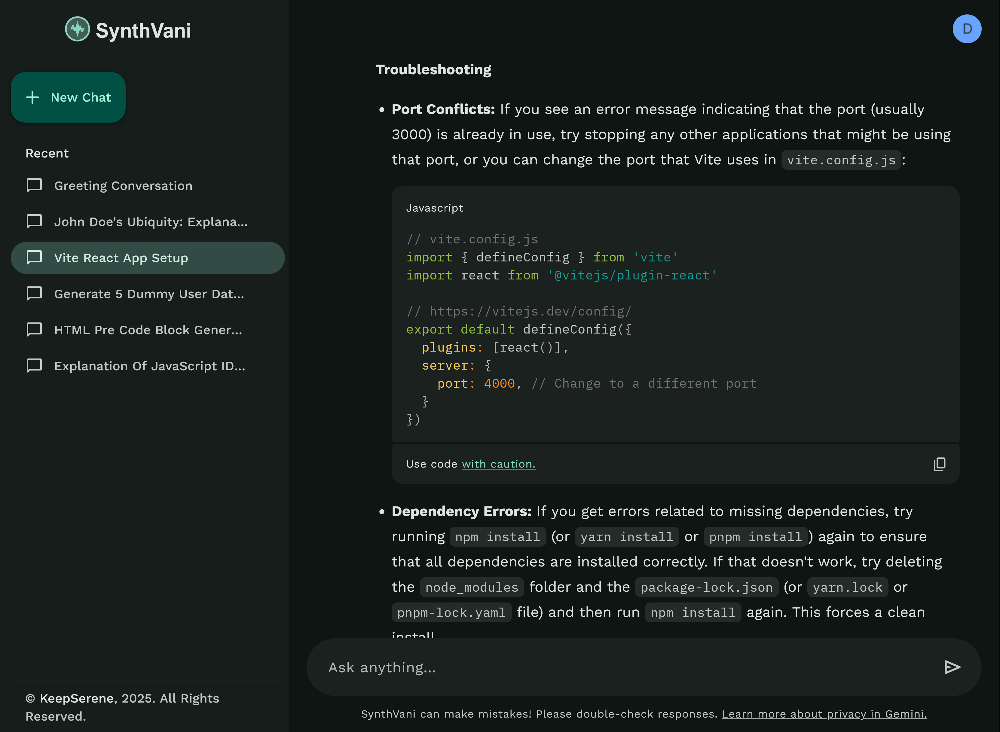

# SynthVani - Your Ideas, Divinely Amplified



SynthVani is a modern, responsive AI chat application powered by Google's Gemini API. This application provides an intuitive interface for conversational AI interaction, allowing users to get intelligent responses, creative inspiration, and problem-solving assistance.

## 🔗 Live Demo

[Check out SynthVani Live](https://synth-vani.vercel.app/)

## ✨ Features

### Core Functionality

- **Advanced AI Interaction**: Seamlessly communicate with Google's Gemini 2.0 Flash model
- **Conversation History**: Save and revisit past conversations
- **Smart Title Generation**: Auto-generate relevant titles for each conversation
- **User Authentication**: Secure account creation and management using Appwrite
- **Dark/Light Mode**: Automatic theme detection based on user's system preferences

### User Interface

- **Material Design 3**: Modern, clean UI following Material Design principles
- **Responsive Layout**: Optimal experience across mobile, tablet, and desktop
- **Smooth Animations**: Powered by Framer Motion for elegant transitions
- **Markdown Support**: Rich text formatting with React Markdown
- **Syntax Highlighting**: Code blocks with language detection and syntax coloring
- **Skeleton Loaders**: Enhanced loading states for better UX
- **Progress Indicators**: Both linear and circular loading animations
- **Toast Notifications**: Contextual snackbar messages for user feedback
- **Copy to Clipboard**: One-click code copying functionality

### Architecture

- **Component-Based Structure**: Modular and maintainable code organization
- **Context API**: Global state management for theme and notifications
- **Custom Hooks**: Reusable logic for common functionality
- **React Router**: Client-side routing with loaders and actions
- **Environment Variables**: Secure API key management

## 🛠️ Tech Stack

### Frontend

- **React 19**: Latest React version with improved rendering capabilities
- **Vite 6**: Lightning-fast development server and optimized builds
- **React Router 7**: Advanced routing with data loading capabilities
- **TailwindCSS**: Utility-first CSS framework for rapid UI development
- **Framer Motion**: Animation library for smooth transitions
- **React Markdown**: Markdown rendering with GFM support
- **React Syntax Highlighter**: Code block formatting and highlighting

### Backend Services

- **Appwrite**: Backend-as-a-Service for authentication and database
- **Google Generative AI**: Gemini API integration for AI capabilities

### Development Tools

- **ESLint 9**: Static code analysis for identifying problems
- **PostCSS**: CSS transformations and optimizations
- **Autoprefixer**: Automatic vendor prefix addition

## 🚀 Getting Started

### Prerequisites

- Node.js (v18+)
- npm or yarn
- Appwrite account
- Google Generative AI API key

### Installation

1. Clone the repository:

```bash
git clone https://github.com/KeepSerene/synth-vani-ai-chat-site.git
cd synth-vani-ai-chat-site
```

2. Install dependencies:

```bash
npm install
# or
yarn install
```

3. Create a `.env` file in the root directory with the following variables:

```env
VITE_APPWRITE_PROJECT_ID=your_appwrite_project_id
VITE_GEMINI_API_KEY=your_gemini_api_key
```

4. Start the development server:

```bash
npm run dev
# or
yarn dev
```

5. Open your browser and navigate to `http://localhost:5173`

## 📦 Build

```bash
npm run build
# or
yarn build
```

This will create a `dist` folder with all the built files ready for deployment.

## 🧪 Testing

```bash
npm run lint
# or
yarn lint
```

## 📜 License

This project is licensed under the MIT License - see the LICENSE file for details.

## 👨‍💻 Author

**Dhrubajyoti Bhattacharjee**

- GitHub: [@KeepSerene](https://github.com/KeepSerene)
- LinkedIn: [Dhrubajyoti Bhattacharjee](https://www.linkedin.com/in/dhrubajyoti-bhattacharjee-320822318/)
- Website: [your-website.com](https://math-to-dev.vercel.app/)

## 🙏 Acknowledgements

- [Google Generative AI](https://ai.google.dev/) for providing the Gemini API
- [Appwrite](https://appwrite.io/) for the backend services
- [React Team](https://reactjs.org/) for the amazing library
- [TailwindCSS](https://tailwindcss.com/) for the utility-first CSS framework
- [Framer Motion](https://www.framer.com/motion/) for the animation capabilities
